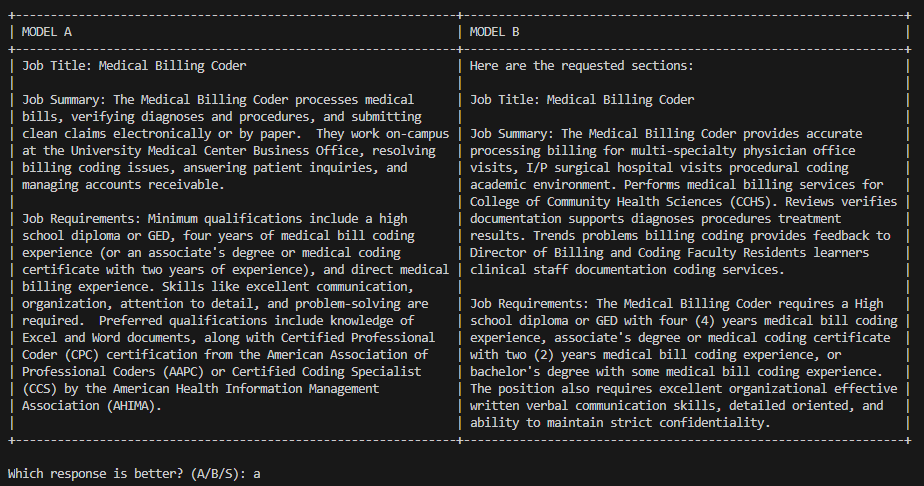
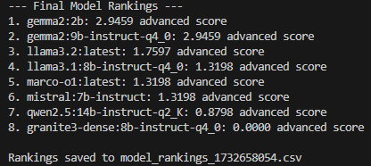

# Local LLM Comparator

## Overview

The Local LLM Comparator is an interactive tool designed to help you systematically evaluate and compare multiple local language models (LLMs) side by side.

## Why Use This Tool?

- **Objective Comparison**: Manually compare responses from different models without bias
- **Flexible Evaluation**: Easily test models on any prompt or task
- **Comprehensive Ranking**: Generate advanced scoring based on pairwise comparisons
- **Logging and Analysis**: Automatically log comparisons and generate ranking reports

## How It Works

Enter your prompt in the main function.

1. Presents responses from two models simultaneously
2. You choose which response is better (or skip)
3. Tracks direct wins between models, calculates scores considering win rate and comparison frequency, and generates a comprehensive ranking.

## Screenshots

### Side-by-Side Model Comparison


### Model Rankings


## Prerequisites

- Ollama (for local model inference)
  - LLMs from ollama
- Required Python packages:
  - `ollama`
  - `requests`

## Installation

```bash
# Clone the repository
git clone https://github.com/yourusername/local-llm-comparator.git
cd local-llm-comparator

# Install dependencies
pip install -r requirements.txt

# Ensure Ollama is installed and models are pulled
ollama pull llama3.2
ollama pull gemma2:2b
# Pull any other models you want to compare
```

## Configuring Models

Modify the `_configure_model_clients()` method in the `ModelComparisonEvaluator` class to customize your model list:

```python
def _configure_model_clients(self) -> Dict[str, ModelClient]:
    return {
        **{model: OllamaClient() for model in [
            "llama3.2:latest",
            "gemma2:2b",
            # Add or remove models as needed
        ]}
    }
```

## Usage Example

In the main function update the prompt and run the code.

```python
def main():
    # Example: Extracting job details from a URL
    url = "your_target_url"
    response = requests.get(url)
    page_content = response.text

    prompt = f"""Your specific task description.
    Content to analyze:
    {page_content}"""
    
    evaluator = ModelComparisonEvaluator()
    evaluator.run_comprehensive_comparisons(prompt)
    evaluator.print_rankings()
```

## Outputs

The tool generates two key outputs:

1. **Comparison Log**: `comparison_log.txt`
   - Tracks which model won each comparison
   - Includes timestamp of comparisons

2. **Rankings CSV**: `model_rankings_[timestamp].csv`
   - Contains final model rankings
   - Includes advanced scoring metrics